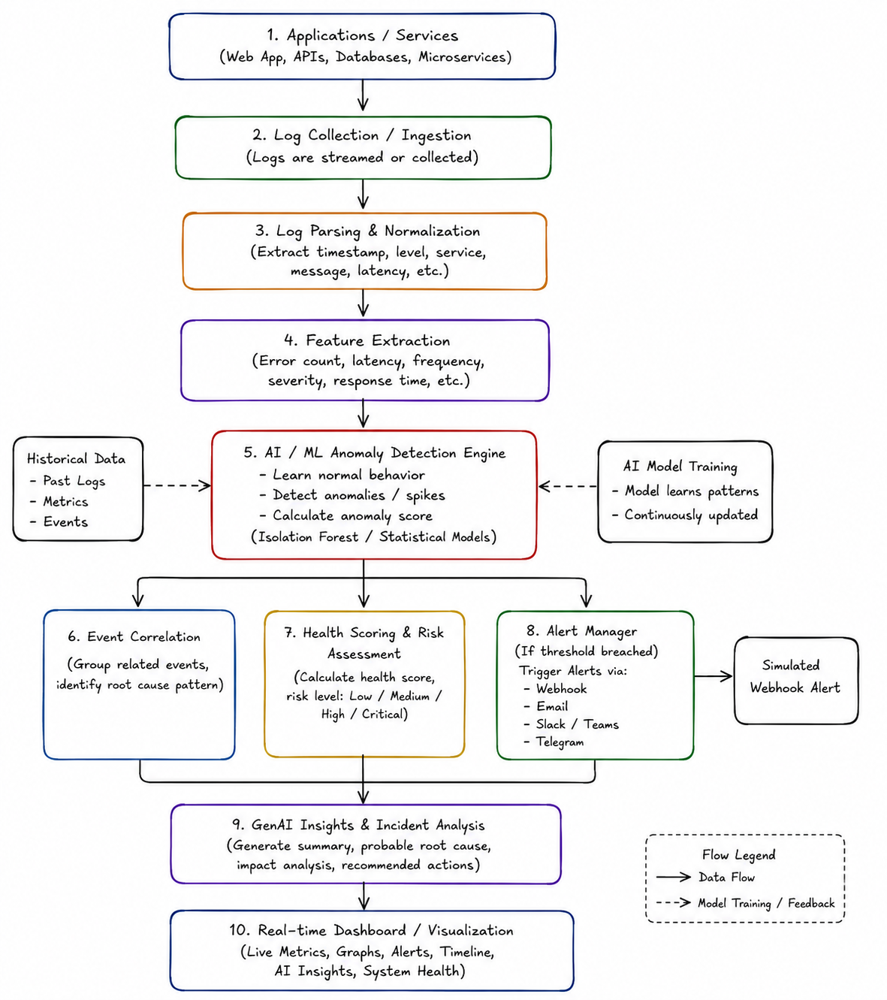
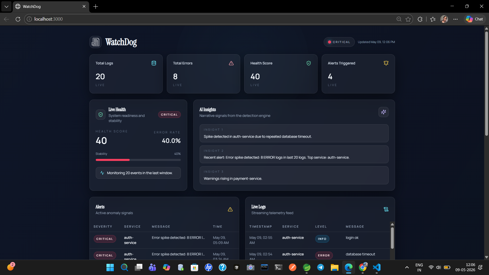
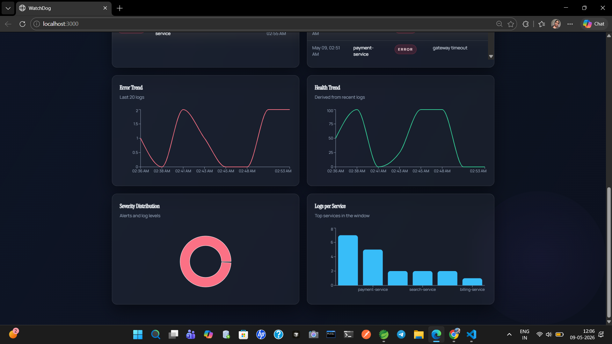

# WatchDog — Intelligent Observability & Event Watchdog


AI-powered observability platform for SRE teams to detect anomalies, score system health, and surface incident insights in real time.

## Overview

WatchDog brings together modern Site Reliability Engineering (SRE) practices with AI-powered anomaly detection to deliver a unified observability experience. It ingests log streams, extracts features, detects error spikes, generates alerts, and produces concise incident insights for fast decision-making. The frontend dashboard provides a live operational view of system health, alert severity, and service-level telemetry.

What it delivers:

- Real-time monitoring with health scoring and service-level telemetry
- AI-style incident insights generated from recent logs and alerts
- Intelligent anomaly detection with alerting and simulated webhooks
- Clean, production-grade dashboard for observability analytics

## Architecture



Flow overview:

1. Log ingestion via FastAPI endpoints
2. Parsing and feature extraction (error rate, per-service counts)
3. Anomaly detection and alert generation
4. AI-style incident insights derived from recent telemetry
5. Dashboard visualization (metrics, health, alerts, charts)

## Feature Highlights

- Real-time observability dashboard
- AI-generated incident insights
- Anomaly detection engine
- Webhook simulation for alerting
- Health scoring with severity classification
- Live monitoring badges and status indicators
- Analytics charts for trends and distributions
- Alerts system with severity indicators
- Service-level telemetry and log streaming

## Frontend Tech Stack

- Next.js (App Router)
- TypeScript
- TailwindCSS
- shadcn/ui
- Recharts

## Backend Tech Stack

- FastAPI
- SQLite
- SQLAlchemy
- Pydantic

## Screenshots




## API Endpoints

- `GET /logs`
- `GET /alerts`
- `GET /metrics`
- `GET /health`
- `GET /insights`

### Sample Responses

`GET /logs`

```json
[
   {
      "id": 120,
      "timestamp": "2026-05-09T18:44:12.123Z",
      "service": "auth-service",
      "level": "ERROR",
      "message": "database timeout"
   },
   {
      "id": 119,
      "timestamp": "2026-05-09T18:43:41.415Z",
      "service": "payment-service",
      "level": "WARNING",
      "message": "retrying payment"
   }
]
```

`GET /alerts`

```json
[
   {
      "id": 12,
      "timestamp": "2026-05-09T18:45:02.905Z",
      "service": "auth-service",
      "severity": "critical",
      "message": "Error spike detected: 7 ERROR logs in last 20 logs.",
      "anomaly_score": 0.72
   }
]
```

`GET /metrics`

```json
{
   "total_logs": 1280,
   "total_errors": 78,
   "total_warnings": 140,
   "alerts_triggered": 6,
   "health_score": 82,
   "system_status": "Warning"
}
```

`GET /health`

```json
{
   "health_score": 82,
   "system_status": "Warning",
   "total_logs": 100,
   "error_count": 7,
   "error_rate": 0.07
}
```

`GET /insights`

```json
{
   "insights": [
      "Spike detected in auth-service due to repeated database timeout.",
      "Payment-service experiencing elevated error frequency.",
      "Recent alert: Error spike detected: 7 ERROR logs in last 20 logs."
   ]
}
```

## Setup

### Backend

```bash
python -m venv .venv
source .venv/bin/activate
pip install -r requirements.txt
uvicorn backend.app.main:app --reload
```

Backend available at `http://127.0.0.1:8000`.

### Frontend

```bash
cd frontend
npm install
npm run dev
```

Frontend available at `http://localhost:3000`.
If the backend runs elsewhere, set `NEXT_PUBLIC_API_BASE` before starting the dev server.

## Project Structure

```text
.
├── backend/
│   └── app/
│       ├── models/
│       ├── routes/
│       ├── services/
│       └── utils/
├── frontend/
│   ├── app/
│   ├── components/
│   ├── lib/
│   └── services/
├── prompts.md
└── README.md
```

## Observability Workflow

1. Logs are ingested through FastAPI endpoints.
2. The detection engine parses logs and extracts features (error rate, counts, per-service volume).
3. Anomaly detection triggers alerts when thresholds are exceeded.
4. AI-style insights summarize the most relevant incidents.
5. The dashboard visualizes metrics, alerts, and trends in real time.

## AI Insights

Insights are generated from the most recent log window and active alerts. The system identifies repeated failures, dominant error messages, and affected services to produce succinct, human-readable summaries that match typical SRE incident narratives.

## Future Improvements

- Websocket streaming for real-time logs
- ML-based anomaly detection and seasonality models
- Slack or PagerDuty alert integration
- Kubernetes cluster monitoring
- Distributed tracing correlation

## Deployment

- Frontend: deploy on Vercel (set `NEXT_PUBLIC_API_BASE` to the backend URL)
- Backend: deploy on Render (configure persistent storage for SQLite or migrate to Postgres)

## Author

- Maintainer: Anwesha Pal
